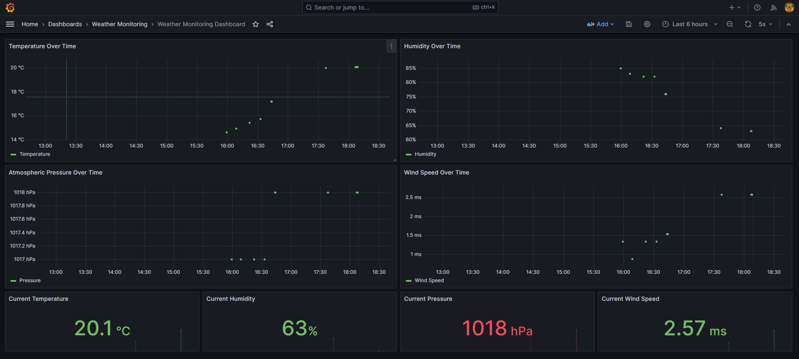

# Weather Monitoring System

Complete weather monitoring system with OpenWeatherMap API, RabbitMQ, Elasticsearch, Logstash, Grafana, and Jenkins.



## Features

-  Weather sampling every hour from OpenWeatherMap API
-  Data sending to RabbitMQ
-  Data flow through Logstash to Elasticsearch
-  Grafana dashboard with alerts
-  CI/CD Pipeline with Jenkins
-  Everything ready for Docker Compose
-  Automatic temperature alerts

## Requirements

- Docker & Docker Compose
- Git

## Installation and Setup

### 1. Environment Variables Setup

Set the city to sample its weather in .env file:
```
CITY_NAME=Rome
```

### 2. Running the System

```bash
# Start all services
docker-compose up -d

# View logs
docker-compose logs -f
docker-compose logs -f weather_monitor
docker-compose logs -f logstash
docker-compose logs -f grafana

# Stop the system
docker-compose down

# Shutdown with volume deletion
docker-compose down -v
```

### 3. Service Access

- **Grafana Dashboard**: http://localhost:3000 (admin/admin)
- **RabbitMQ Management**: http://localhost:15672 (guest/guest)
- **Elasticsearch**: http://localhost:9200
- **Jenkins**: http://localhost:8080

### 4. Health Checks

```bash
# Check Elasticsearch
curl http://localhost:9200/_cluster/health?pretty
```

**Output:**
```json
{
  "cluster_name" : "docker-cluster",
  "status" : "green",
  "timed_out" : false,
  "number_of_nodes" : 1,
  "number_of_data_nodes" : 1,
  "active_primary_shards" : 1,
  "active_shards" : 1,
  "relocating_shards" : 0,
  "initializing_shards" : 0,
  "unassigned_shards" : 0,
  "delayed_unassigned_shards" : 0,
  "number_of_pending_tasks" : 0,
  "number_of_in_flight_fetch" : 0,
  "task_max_waiting_in_queue_millis" : 0,
  "active_shards_percent_as_number" : 100.0
}
```

```bash
# Check weather data
curl "http://localhost:9200/weather-*/_search?pretty&size=1&sort=@timestamp:desc"
```

**Output:**
```json
{
  "took" : 2,
  "timed_out" : false,
  "_shards" : {
    "total" : 1,
    "successful" : 1,
    "skipped" : 0,
    "failed" : 0
  },
  "hits" : {
    "total" : {
      "value" : 14,
      "relation" : "eq"
    },
    "max_score" : null,
    "hits" : [
      {
        "_index" : "weather-2025.10.16",
        "_id" : "xgZD7ZkBH4X4hNc8CRck",
        "_score" : null,
        "_source" : {
          "country" : "US",
          "city" : "Rome",
          "temperature" : 20.09,
          "humidity" : 63,
          "pressure" : 1018,
          "wind_speed" : 2.57,
          "@timestamp" : "2025-10-16T15:37:57.250Z"
        }
      }
    ]
  }
}
```

```bash
# Check RabbitMQ
Invoke-WebRequest -Uri "http://localhost:15672/api/queues" -Headers @{"Authorization"="Basic Z3Vlc3Q6Z3Vlc3Q="}
```

**Output:**
```
StatusCode        : 200
StatusDescription : OK
Content           : []
RawContent        : HTTP/1.1 200 OK
                    content-security-policy: script-src 'self' 'unsafe-eval' 'unsafe-inline'; object-src 'self'        
                    vary: accept, accept-encoding, origin
                    Content-Length: 2
                    Cache-Control: no-cache
                    Content...
Forms             : {}
Headers           : {[content-security-policy, script-src 'self' 'unsafe-eval' 'unsafe-inline'; object-src 'self'],    
                    [vary, accept, accept-encoding, origin], [Content-Length, 2], [Cache-Control, no-cache]...}        
Images            : {}
InputFields       : {}
Links             : {}
ParsedHtml        : mshtml.HTMLDocumentClass
RawContentLength  : 2
```

**Note:** When checking health for RabbitMQ on a different OS than Windows, you can use this command:
```bash
curl -u guest:guest http://localhost:15672/api/queues
```

## Project Structure

```
├── weather_monitor.py          # Main Python application
├── requirements.txt            # Python dependencies
├── Dockerfile                  # Docker image for application
├── docker-compose.yml          # All services configuration
├── logstash.conf              # Logstash configuration
├── weather_template.json       # Elasticsearch template
├── Jenkinsfile                # CI/CD Pipeline
├── grafana/
│   ├── provisioning/
│   │   ├── datasources/       # Elasticsearch configuration
│   │   └── dashboards/        # Dashboard configuration
│   └── dashboards/
│       └── weather-dashboard.json # Grafana dashboard and alerts
└── README.md
```

## CI/CD Pipeline

The Pipeline includes:

1. **Clone** - Code cloning
2. **Build** - Docker image building
3. **Deploy** - Production deployment
4. **Notify Success** - Success notification

## Grafana Alerts

The system includes **automatic alerts** that are **pre-configured** and ready to use.
The alert automatically triggers when temperature drops below **0°C** or rises above **24°C**
The alert state shows as the color of the dot, if it's in alert state it will be colored red, otherwise green.


## Issues I encountered with

### Time format mismatch

I had some issues when manipulating the time variables due to wrong formats, 
I used my past experience of an old issue I had years ago and converted all the variables to UTC format using the right ISO and the '+Z' postfix.

### curl command issue

curl command didn't work in PowerShell, caused parameter ambiguity errors.
Due to the assignment content and purpose, I decided not to troubleshoot it and invest the remaining time on more important issues

### Grafana aggregations issue

I began with using bucketAggs but when it was empty it caused "missing metrics and aggregations" errors so I added date_histogram bucket aggregations to all stat panels